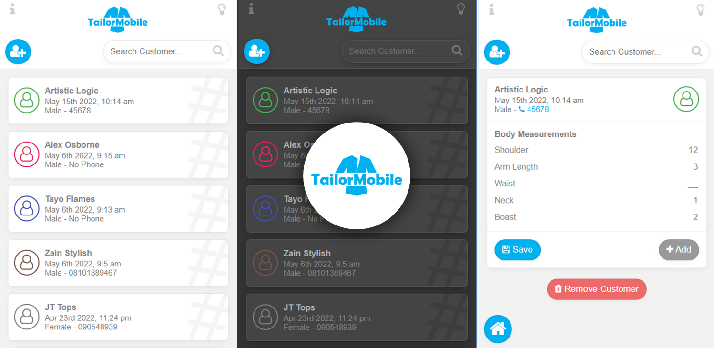

## TailorMobile
TailorMobile is a mobile app for record keeping made for tailors to simplistically store and access the measurement information of their customers on their phones. (by https://artisticlogicmk.one) 
Test it [here](https://tailormobile.artisticlogicmk.one) or [download the app](https://tailormobile.artisticlogicmk.one/download/TailorMobile_v1.0.0.apk)

Please star this repo and feel free to fork and add to it.

Uses:
Vuejs 3, javascript, Jquery, momentjs.
